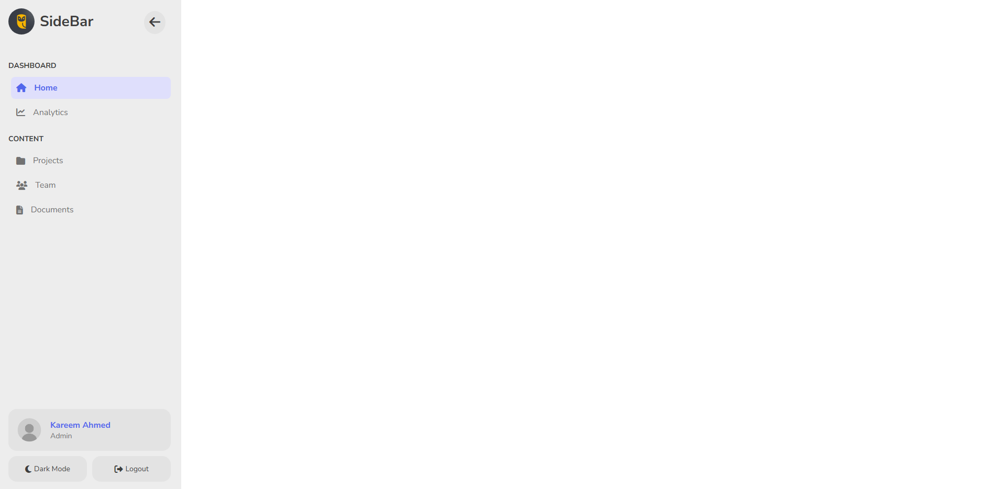
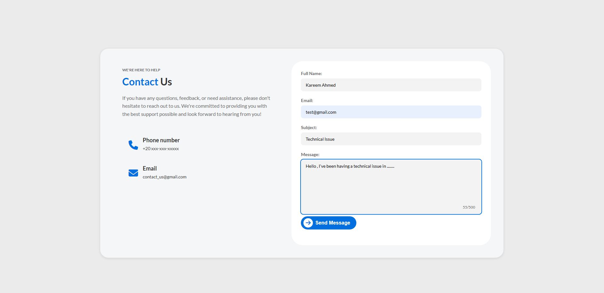
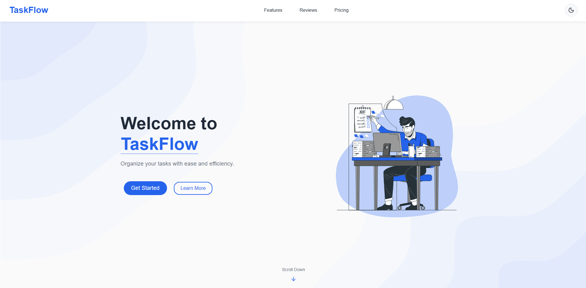
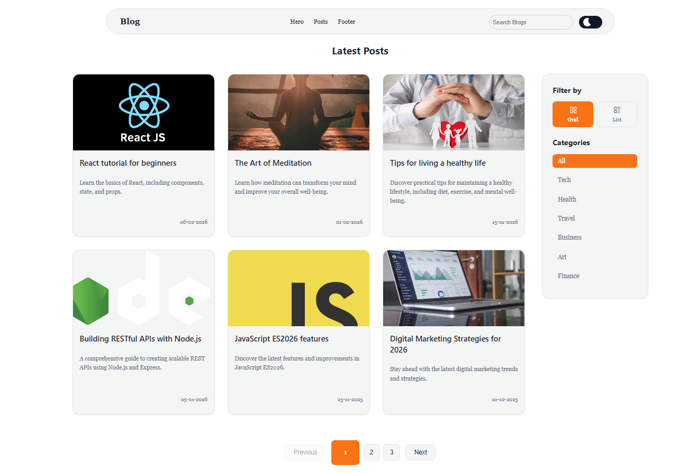

# Elevvo Internship Projects

🔗 **Live Demo**: [https://kareemh-1.github.io/Elevvo-Internship/](https://kareemh-1.github.io/Elevvo-Internship/)

---

## Projects Overview

| # | Project Name | Description | Technologies | Link |
|---|--------------|-------------|--------------|-----------|
| 1 | Collapsible Sidebar | A responsive sidebar navigation component with smooth collapse/expand animations | HTML, CSS, JavaScript | [View Demo](./Task1-Collapsible-Sidebar/) |
| 2 | Contact Form | An interactive contact form with validation | HTML, CSS, JavaScript | [View Demo](./Task2-Contact_Form/) |
| 3 | TaskFlow App | A Home page for a task management app with clean UI, animations, pricing and feature cards | React, Vite, JSX | [View Demo](./Task3-Task%20App/) |
| 4 | Personal Blog | A responsive blog homepage with dynamic content, search, category filtering, and theme switching | React, Vite, State Management | [View Demo](./Task4-BlogHomePage/) |

---

## Project

### 1. Collapsible Sidebar
[](https://kareemh-1.github.io/Elevvo-Internship/Task1-Collapsible-Sidebar/sidebar.html)
**[View Live Demo →](https://kareemh-1.github.io/Elevvo-Internship/Task1-Collapsible-Sidebar/sidebar.html)**

### 2. Contact Form
[](https://kareemh-1.github.io/Elevvo-Internship/Task2-Contact_Form/contact-form.html)
**[View Live Demo →](https://kareemh-1.github.io/Elevvo-Internship/Task2-Contact_Form/contact-form.html)**

### 3. TaskFlow App
[](https://taskflowelevvo.netlify.app/)
**[View Live Demo →](https://taskflowelevvo.netlify.app/)**

### 4. Personal Blog
[](https://personalblog-elevvo.netlify.app/)
**[View Live Demo →](https://personalblog-elevvo.netlify.app/)**

---

## Getting Started

### Static Projects (Tasks 1 & 2)
Simply open the HTML files in your browser:
```bash
# Navigate to project folder and open HTML file
cd Task1-Collapsible-Sidebar
# Open sidebar.html in browser
```

### React Projects (Tasks 3 & 4)
Install dependencies and run the development server:
```bash
# Navigate to project folder
cd "Task3-Task App"  # or "Task4-Personal Blog"

# Install dependencies
npm install

# Start development server
npm run dev
```

---

## Technologies Used

- **Frontend**: HTML5, CSS3, JavaScript (ES6+), React
- **Build Tools**: Vite
- **Linting**: ESLint
- **Styling**: Custom CSS

---

Created during Elevvo Internship

## License

This project is part of an internship program.
